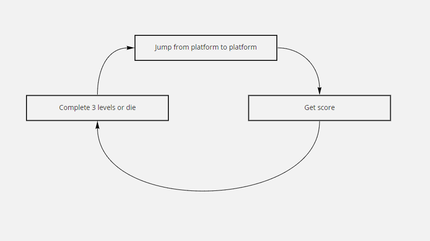

# Unreal_Engine_HW1

##Third person 3D platformer game
##Design Document

##Main aim
Pass 3 levels and reach the finish platform on level 3 (in addition to get as much score as possible). Player should jump from platform to platform, avoiding obstacles. Main obstacles are different types of platforms and objects that can knock the player off or instantly kill him.

##Interface
Interface consists of level controls.
Actions are achieved via either hovering mouse or using WASD(hovering) and Enter buttons.

While the player is inside the level he can:
Navigate through level using WASD
Rotate camera by moving the mouse
Jump by pressing space bar
Look at the score in the top left corner

When the player win or lose he can restart the game by pressing Enter button

##Gameplay
Gameplay consists of jumping from platform to platform and avoiding obstacles that can kill or knock player off.
The stages of gameplay:
Jumping from platform  to platform, collecting score
Death or completing the game(pass 3 levels and reach the finish platform on level 3)
After the death or completing 3 levels, gameplay returns to the first point.

##Game Mechanics
Main mechanic of the game is jumping from platform to platform. Some other game mechanics are used in this game, for example rotating obstacles that kill the player but the player can jump over.

##Algorithms
The main algorithm of the game is procedural generation of the levels. It is based on choosing random platform from array of platforms of the level and placing them at a generated position.In for loop firstly creates the location of platform using written function that takes X and Y coordinates of the previous platform and adds randomly generated values to them in purpose to add complexity to the game(it provides different relative position of platforms). Then it chooses a random index from an array of types of platforms for the level and spawn chosen type of platform. Form some kinds of platforms(knocking off platform and deadly platform) in addition moving obstacles spawns on them. When the for loop is over the finish platform spawns with the same process of choosing position.

This algorithm is flexible to change, because for some generation processes parameters can be changed (for example the amount of spawning platforms or array of types of platforms).

The complexity of the game increases with the next parameters:
The higher the level is - more types of platforms can be spawned on it(and types become more deadly)
The number of platforms spawning between start and finish increases from level to level
The speed of rotating objects increases from level to level

##Plot
This prototype has no plot yet.

##World
World is presented by 3 levels. Each planet consists of 12 platforms. Level is generated randomly considering the specifics and filled with different platforms from the set of types of platforms for the level(the amount of types of platforms in the set increases from level to level)

##Moving obstacles
The game has 3 types of moving obstacles:

Spinning platform - circle shaped platform that rotates around Z axis with constant speed and prevents player from running straight
Knocking Off Rotator - element of the knocking off platform that looks like a mill blade, that affects the player position when colliding and can knock the player off the platform. In addition if players jump on this element it will also affect his position, so the only way to pass knocking off platforms is run on the platform, not the rotating element. 
Deadly Rotator - element of the deadly platform that rotates around Z axis with constant speed and can kill player when collides with him

##Non moving objects
The game has non moving objects:
Start platform on the level - simple platform
Platform with wall - platform with a wall in the middle, that should be jumped over by the player
Bonus platform - green platform. When player steps on it he gains score(the amount of gained score depends on the level)
Finish platform - checkerboard platform. When the player steps on it the new level opens, or if it is the last level the winning screen appears

##References
Some game mechanics and design ideas were inspired by Fall Guys game. For example knocking off rotator design and behavior are similar to the spinning barriers in Fall Guys. Such inspiration helped to create a game with catchy mechanics, so player will get great experience while playing it.

##Gameplay Scheme

